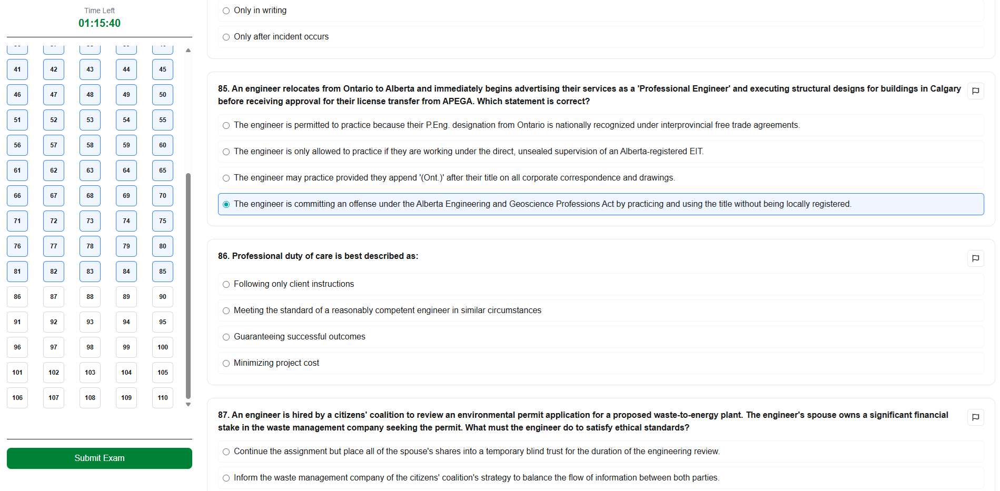
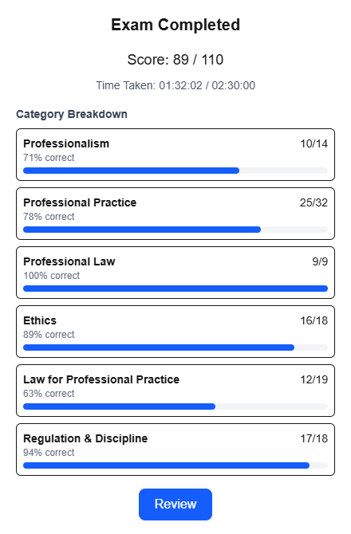

# 🍁 NPPE Practice Exam Simulator

An unofficial, browser-based practice tool for Canadian engineering professionals preparing for the **National Professional Practice Exam (NPPE)**. Covers ethics, professional responsibility, law, and regulatory practice.

> **Disclaimer:** This is an unofficial practice tool created for educational purposes only. This project is not affiliated with or endorsed by Engineers Canada or any provincial/territorial engineering regulator. All trademarks and organization names remain the property of their respective owners.

---

## 📸 Screenshots

| Practice Exam | Results & Scoring |
|---|---|
|  |  |

---

## ✨ Features

- **Timed Sessions** — Countdown timer keeps you exam-ready under pressure
- **Multiple-Choice Questions** — Realistic scenario-based questions across all NPPE topic areas
- **Question Navigator** — Sidebar grid lets you jump to any question and track answered vs. unanswered
- **Flag for Review** — Bookmark questions to revisit before submitting
- **Instant Scoring** — See your total score and time taken immediately after submission
- **Category Breakdown** — Results broken down by topic so you know exactly where to focus
- **Full Review Mode** — After submitting, review every question with correct answers highlighted
- **Mobile Friendly** — Responsive layout works on phones and tablets

---

## 📚 Exam Modes

| Mode | Questions | Time Limit |
|---|---|---|
| **Short Exam** | 45 questions | 1 hour |
| **Full Exam** | 110 questions | 2 hours 30 min |
| **Question Bank** | Browse all questions |

---

## 🗂️ Topic Categories

| Category | Description |
|---|---|
| **Professionalism** | Professional identity, conduct, and obligations |
| **Professional Practice** | Engineering decisions, sealing, and project responsibilities |
| **Professional Law** | Legal frameworks governing engineering practice |
| **Ethics** | Ethical reasoning and conflict resolution |
| **Law for Professional Practice** | Contracts, liability, and regulatory compliance |
| **Regulation & Discipline** | Licensing, provincial acts, and disciplinary processes |

---

## 💡 Study Tip

> Focus on **ethical reasoning** rather than memorization. NPPE questions test your ability to apply principles to realistic scenarios — understanding *why* an answer is correct matters more than recalling facts.

---

## 🤝 Contributing Questions

Anyone can contribute new questions without touching any code:

1. Go to the **Question Bank** page on the website
2. Copy the **generation prompt** provided there
3. Paste it into **ChatGPT**, **Gemini**, or any other AI assistant and generate new questions
4. Copy the AI's output and paste it back into the **import field** on the Question Bank page
5. The questions will be loaded into the simulator instantly

Please ensure generated questions cover realistic professional practice scenarios and are not copied from official exam materials.

---

## 📄 License

This project is released for educational use. See [LICENSE](LICENSE) for details.
